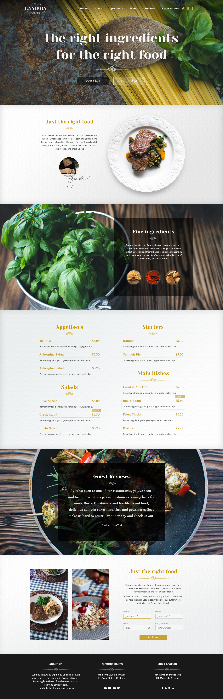

# Bài tập cho intern 2 tuần

1. Giao diện
- Chuyển thiết kế đã cho thành html web
- Không yêu cầu resonsive
- Mục tiêu : 
  - Nhanh(có thể sử dụng framework)
  - Giống thiết kế 
  - Các thành phần tương tác cơ bản : link, menu, input ... phải phản hồi được thao tác chuột(hover, click), slide chạy.
- [Chú ý và lỗi hay gặp](help.md)
2. Code PHP
- Tạo 1 trang php để quản trị 1 phần nhỏ trong giao diện đã kẻ trước đó
- Mục tiêu : 
  - Nhanh(Có thể dùng framework, ưu tiên hướng đối tượng)
  - Quản lý được dữ liệu(BREAD = browse, read, edit, add delete) 
  - Logic code tốt
  - Hàm ngắn(không quá 40 dòng 1 hàm)
  - Dễ đọc(tên hàm, tên biến, quá trình xử lý)

3. Một số giao diện

3.1 Restaurant

3.2 Yêu cầu(PHP)

- Quản lý được menu top
- Quản lý danh mục món ăn
- Nhận các request từ form đăng ký cuối trang, hiển thị danh sách trong trang quản lý
_Chú ý đến validate đầu vào, các tính năng nên có suy ra từ giao diện_
_Nếu sử dụng tool hay framework hỗ trợ code nhiều thì nên viết theo đúng quy trình nên có của framework như Model, FormRequest, Migration đối với laravel_