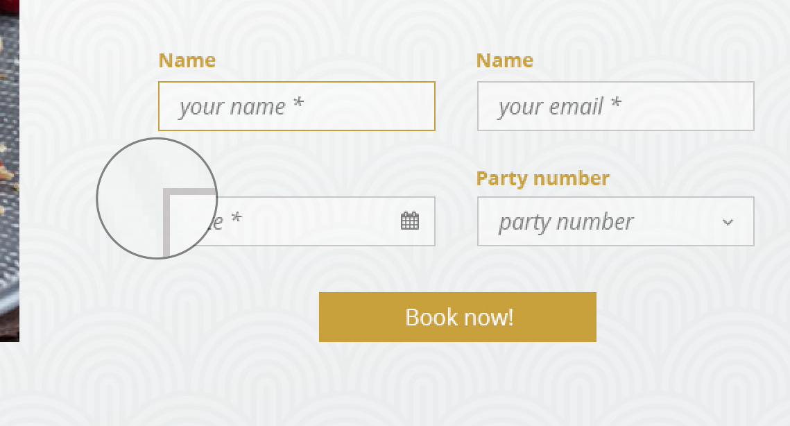
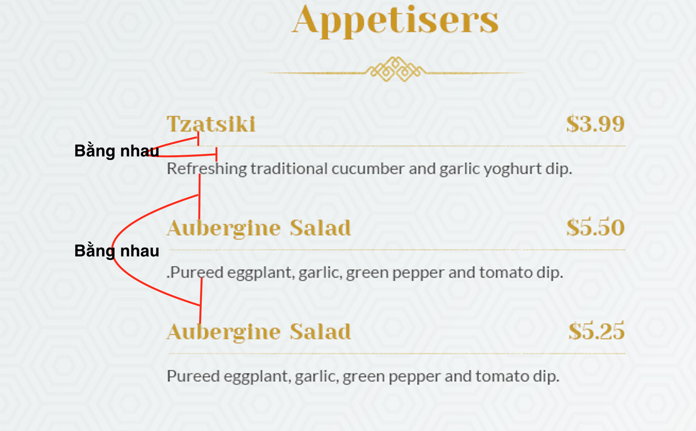
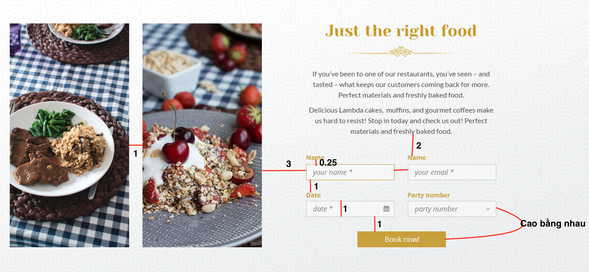

# Lỗi hay gặp

- Font chữ : Chọn font chữ gần giống hoặc lấy đúng như trong file psd
- Kích thước chữ : đảm bảo số dòng, chiều rộng trong thiết kế và khi thành html phải giống nhau.

- Cắt ảnh : cắt các thành phần không css được, còn lại cố gắng sử dụng css để tạo hiệu ứng như : bo tròn, bóng đổ

- Style của input, các góc tròn hay nhọn, tròn ít hay nhiều
- Các hiệu ứng khi hover, focus có được thể hiện trong thiết kế hay không

- Khoảng cách, padding : chú ý đến độ lớn phù hợp với web html, và tỉ lệ giữa các khoảng cách với nhau

# Chú ý

- Chọn 1 template ban đầu chuẩn(chọn 1 file theo bootstrap hoặc theo chuẩn html5)
- Các style common phổ biến và áp dụng cho các thẻ cần được khai báo trước như các thẻ head, thẻ a, thẻ p, ... cần được khai báo trước. Nếu dùng bootstrap cần chú ý đến file variables để cài đặt các thuộc tính ban đầu giống với thiết kế nhất : 5 màu cơ bản, kích thước, kiểu chữ, ...
